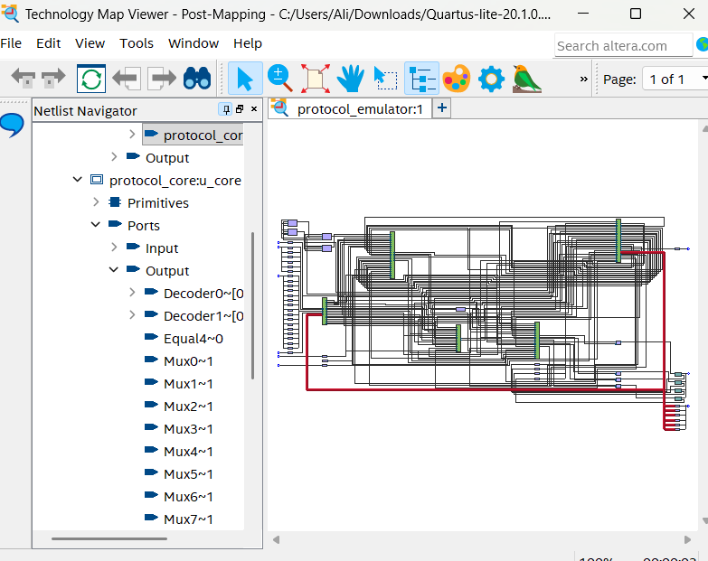
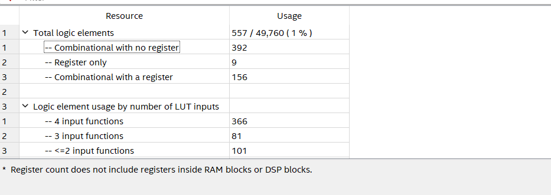
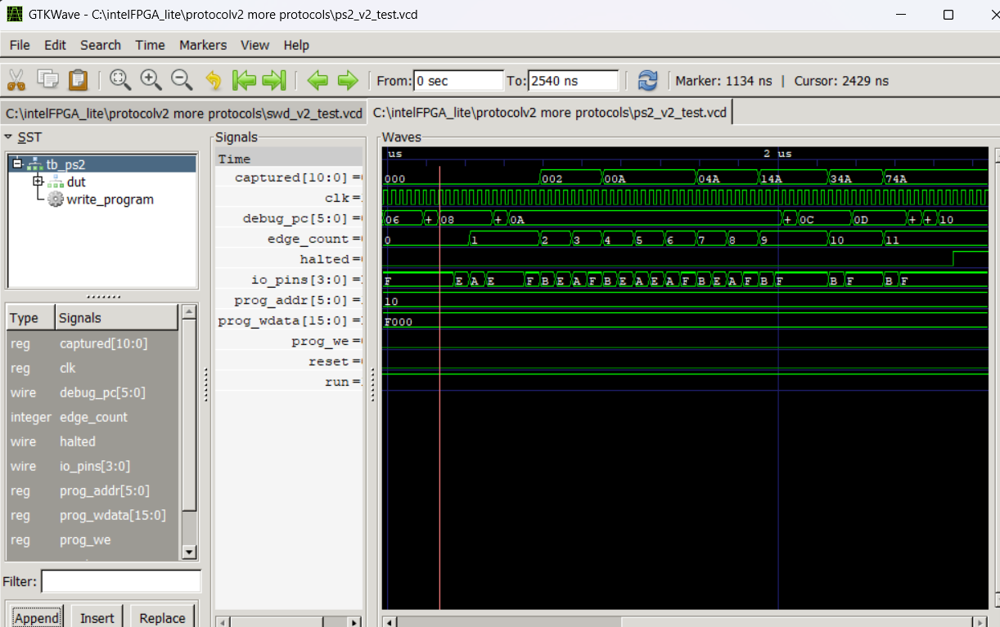
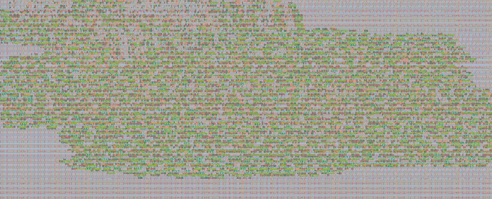

   

# Runtime-Programmable Multi-Protocol Serial Engine

A reprogrammable communication engine supporting **UART, SPI, I2C, JTAG, PS/2 and SWD on one shared hardware core**.

Instead of building a separate controller for every protocol, we built the common timing, bit-transfer and pin-control hardware once. The protocol itself is stored as a small program in writable memory, so the same hardware speaks different interfaces depending on the loaded program.

The design was developed on a **DE10-Lite FPGA**, verified in simulation and on hardware, then adapted for **Tiny Tapeout / IHP CMOS5L** and taken through gate-level verification, physical design and GDS generation.

---

## Architecture

The supported protocols are different, but they repeatedly need the same basic actions: drive or read a pin, wait for timing, shift bits, generate clocks, store received data and branch on a response.

We turned those actions into a shared core with a **64 x 16-bit writable program memory**. Each protocol is a microprogram, not a hardware block.

- **UART** loads a program that sends a start bit, data bits and a stop bit.
- **SPI** uses the same core to control a clock, chip-select and serial data.
- **I2C** sends an address, releases the data line, reads the target's ACK and branches on the result.

Changing the program changes the protocol without replacing the hardware.

  

<em>Quartus post-synthesis view of the shared protocol core.</em>

---

## Hard-Coded vs Programmable

A conventional multi-protocol design places UART, SPI, I2C, JTAG, PS/2 and SWD controllers side by side. Each controller brings its own state machine, timing, registers, shifter and pin-control logic, duplicating work even though only one protocol is active at a time.

The programmable version pays an upfront cost for program memory and instruction execution, but reuses the same timer, shifter, registers and I/O control across all protocols. Adding another protocol means writing another program, not another controller.

### Measured FPGA results (Quartus, MAX 10 DE10-Lite, 50 MHz)

| Supported protocols | Hard-coded design | Programmable design |
|---:|---:|---:|
| 3 | **347 LEs** | **557 LEs** |
| 4 | **475 LEs** | **557 LEs** |
| 5 | **572 LEs** | **557 LEs** |
| 6 | **762 LEs** | **557 LEs** |

Programmability is not always smaller. With three or four protocols, the fixed controllers use less logic. Around **five protocols** the two approaches break even. At six:

**762 LEs to 557 LEs (205 fewer, ~27% reduction)**

> **Note on memory accounting:** the programmable design stores its 1,024-bit program memory in FPGA block RAM, which is not counted in the LE total. When the same memory is built from registers (as it is on the ASIC), the programmable design uses 1,299 ALUTs and 1,188 registers. The 27% figure is the FPGA LE comparison and should be read with that context.

  

<em>Quartus resource report for the 557-LE programmable implementation.</em>

---

## Key Results

### FPGA (Quartus, MAX 10, 50 MHz)

| Metric | Result |
|---|---:|
| Programmable implementation | **557 LEs** |
| 6-protocol hard-coded implementation | **762 LEs** |
| Logic saved | **205 LEs / ~27%** |
| Registers | **165** |
| Program memory | **64 x 16 = 1,024 bits** |
| Setup slack (slow 1200mV 85C) | **+9.537 ns** |

### ASIC (IHP 130nm CMOS5L via Tiny Tapeout, 50 MHz)

| Metric | Result |
|---|---:|
| Standard cells | **7,822** |
| Sequential cells (flip-flops) | **1,238** |
| Cell area | **143,327 um2** |
| Utilization (6x4 tile) | **15.9%** |
| Setup slack (worst corner) | **+8.77 ns** |
| Hold slack (worst corner) | **+0.124 ns** |
| Total power | **4.44 mW** |
| DRC / LVS / antenna violations | **0 / 0 / 0** |
| Gate-level protocol tests | **6 / 6 passed** |

---

## Verification

We used **Icarus Verilog** for RTL simulation and **GTKWave** to inspect the protocol signals. A test was not considered correct just because the program halted; the transmitted bits, clocks and external responses had to match the expected transaction. The same six programs were then verified at gate level through **cocotb** on the ASIC netlist.

| Protocol | What was checked |
|---|---|
| **UART** | Start bit, 8 data bits and stop bit |
| **SPI** | 8 clock edges, transmitted byte and chip-select behavior |
| **I2C** | START, address byte 0xA0, target ACK, STOP |
| **PS/2** | Start bit, 8 data bits LSB first, odd parity, stop bit |
| **SWD** | 8-bit request, 3-bit target ACK, turnaround, 32-bit payload + parity |
| **JTAG** | TAP state walk through Shift-DR, 8-bit TDI scan, return to Run-Test/Idle |

### PS/2 waveform

  

<em>PS/2 device-to-host frame: start, 8 data bits (0xA5), odd parity, stop.</em>

### SWD waveform

  

<em>SWD write request, turnaround (line released), 3-bit ACK, 32-bit data phase.</em>

---

## FPGA to ASIC

The core architecture stayed the same. The changes for ASIC integration were:

- Split bidirectional pins into separate output, output-enable and input (Tiny Tapeout pad ring owns the tri-state)
- Removed the Intel-specific block RAM attribute (program memory becomes flip-flops)
- Adapted reset polarity for the Tiny Tapeout active-low `rst_n`
- Added an **8-bit sequential program loader** so the chip is reprogrammable after fabrication through its pins

  

<em>Placed-and-routed ASIC region (IHP 130nm CMOS5L, 6x4 Tiny Tapeout tile).</em>

---

## All Screenshots

Every Quartus report, simulation waveform and GDS layout image is listed in [assets/images/INDEX.md](assets/images/INDEX.md).

---

## Tiny Tapeout Datasheet

Pin map, loading sequence and usage details: [docs/info.md](docs/info.md)

---

## Tools

**Verilog · Quartus Prime · Icarus Verilog · GTKWave · Cocotb · Python · DE10-Lite · Tiny Tapeout · LibreLane · IHP CMOS5L · Git/GitHub**

---

## Team

**Ali Barrak · Aadit Mital**